# TeraSort

## Overview

>A simple **TeraSort** Implementation that is based on *Hadoop MapReduce framework*.

## Content


<!-- toc orderedList:0 depthFrom:1 depthTo:6 -->

* [TeraSort](#terasort)
  * [Overview](#overview)
  * [Content](#content)
    * [Preliminary knowledge](#preliminary-knowledge)
    * [Key idea](#key-idea)
    * [Execute Step](#execute-step)
      * [1.Produce Test Data](#1produce-test-data)
      * [2.Run Sort Algorithm](#2run-sort-algorithm)
        * [By Shell](#by-shell)
          * [1.Make directory in hdfs and put your input data file to it](#1make-directory-in-hdfs-and-put-your-input-data-file-to-it)
          * [2.Run jar to do map reduce task](#2run-jar-to-do-map-reduce-task)
          * [3.Get output file from hdfs to local file system](#3get-output-file-from-hdfs-to-local-file-system)
        * [By IDE](#by-ide)
          * [Configure](#configure)
          * [Just run it](#just-run-it)
      * [3.Merge Output files](#3merge-output-files)
      * [4.Get Top K Value](#4get-top-k-value)
  * [Appendix](#appendix)
    * [Recommend](#recommend)
    * [Thanks](#thanks)
    * [License](#license)

<!-- tocstop -->


### Preliminary knowledge

>Shuffle: data from map task to reduce task.

>Partition: decide the current output data should be passed to which reduce task to process according to key or value or the number of reduce tasks(Here, based on key and the number of reduce tasks).

### Key idea

**sample + partition**

Sample: get the split points according to the number of reduce tasks.

```java
InputFormat inputFormat = new TextInputFormat();
List<InputSplit> inputSplitList = inputFormat.getSplits(job);

int splitSize = inputSplitList.size();
int samplePerPartition =
        sampleNum / splitSize;
```

Notice **inputSplitList.size()** will be 1 if the file size below *the block size of HDFS(64MB or 128MB)*.

Sample for the first *samplePerPartition* records.

```java
List<Integer> sampleList = new ArrayList<>();
for (InputSplit split : inputSplitList) {
    TaskAttemptContext context = new TaskAttemptContextImpl(
            job.getConfiguration(), new TaskAttemptID()
    );
    RecordReader<Object, Text> reader =
            inputFormat.createRecordReader(split, context);
    Text text;
    reader.initialize(split, context);

    int count = 1;
    while (reader.nextKeyValue()) {
        if (count > samplePerPartition) {
            break;
        }
        text = reader.getCurrentValue();
        sampleList.add(
                Integer.parseInt(text.toString())
        );
        count++;
    }
    reader.close();
}
```

After Sort, get split points and write them into local file system, prepare for partition.

```java
FileSystem fs = FileSystem
        .get(job.getConfiguration());
DataOutputStream writer = fs
        .create(SPLIT_SAMPLE_PATH, true);

int stepLength =
        sampleList.size() / job.getNumReduceTasks();
int n = 0;
for (int i = stepLength; i < sampleList.size(); i += stepLength) {
    n++;
    if (n >= job.getNumReduceTasks()) {
        break;
    }
    new Text(sampleList.get(i) + "\r\n")
            .write(writer);
}

writer.close();
```

Partition: do partition according to the split points(namely the number of reduce tasks).

```java
@Override
public int getPartition(IntWritable key, NullWritable value, int reduceNum) {
    if (splitPoints == null) {
        splitPoints = TeraSortSampler.getSplitPoints(conf, reduceNum);
    }

    // just for print
    System.out.println("Key:" + key);

    int index = splitPoints.length;
    for (int i = 0; i < splitPoints.length; i++) {
        if (key.get() < splitPoints[i]) {
            index = i;
            break;
        }
    }
    return index;
}
```

### Execute Step

#### 1.Produce Test Data

Run [DataGenerator](https://github.com/happylrd/buptsse-workbooks/blob/master/Hadoop/TeraSort/src/io/happylrd/datagen/DataGenerator.java) to generate test data in input directory.

Result


#### 2.Run Sort Algorithm

Run [TeraSort](https://github.com/happylrd/buptsse-workbooks/blob/master/Hadoop/TeraSort/src/io/happylrd/terasort/TeraSort.java), it will output some files in output directory, the number is determined by the reduce number that you choose.

You can do it in two ways, one by shell, another by IDE.

##### By Shell

###### 1.Make directory in hdfs and put your input data file to it

Just execute
`hdfs dfs -mkdir /user/happylrd/TeraSort`

`hdfs dfs -put /home/happylrd/MyCode/HadoopProjects/TeraSort/data/input/ /user/happylrd/TeraSort`

Meanwhile, you can query for validation.
`hdfs dfs -ls -R | grep TeraSort`

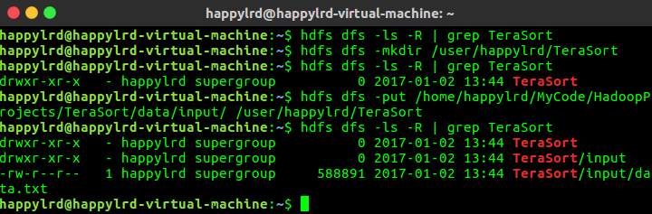

###### 2.Run jar to do map reduce task

Just execute

```
hadoop jar /home/happylrd/MyCode/HadoopProjects/TeraSort/out/artifacts/terasort/terasort.jar io.happylrd.terasort.TeraSort /user/happylrd/TeraSort/input /user/happylrd/TeraSort/output
```

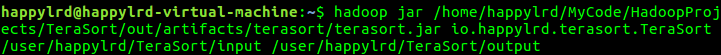

Result

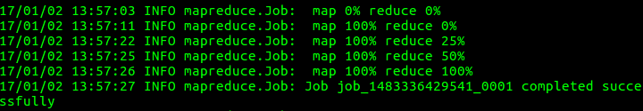

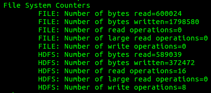

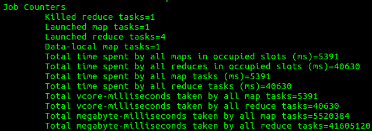

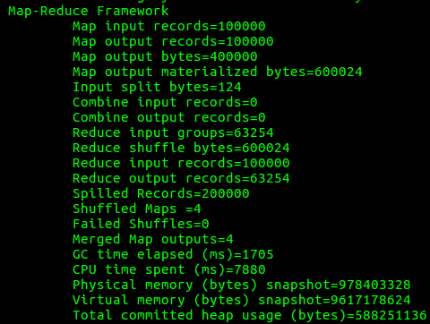

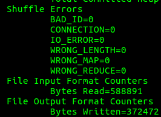

Query for validation

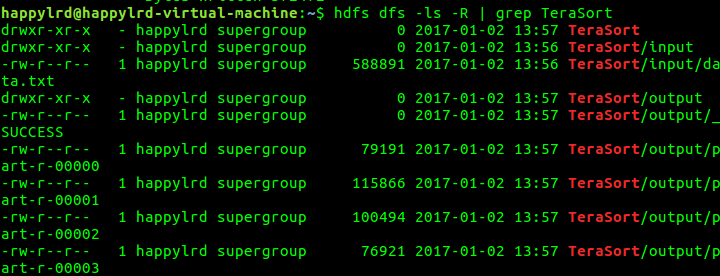

Everything goes well.

###### 3.Get output file from hdfs to local file system

Just execute
`hdfs dfs -get /user/happylrd/TeraSort/output /home/happylrd/MyCode/HadoopProjects/TeraSort/data/`

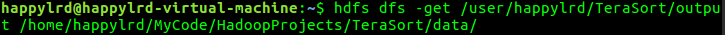

Result

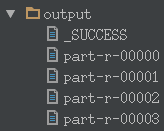

##### By IDE

###### Configure

Let `org.apache.hadoop.util.RunJar` as Main class.


Configure program arguments.

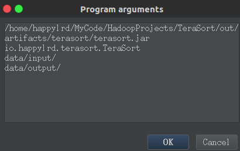

###### Just run it

Result

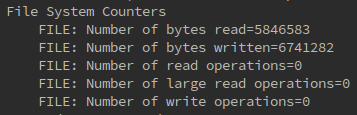

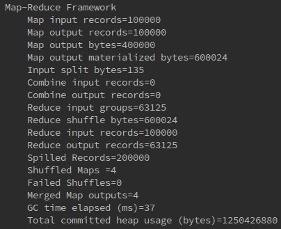

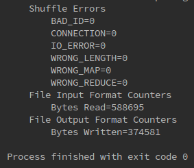

#### 3.Merge Output files

Run [merge.sh](https://github.com/happylrd/buptsse-workbooks/blob/master/Hadoop/TeraSort/scripts/merge.sh) to merge the output files that the reduces produce.

Shell script is as follows
```shell
#!/usr/bin/env bash
cd ../data/output
cat part-* > ../mergeResult/all-result.txt
```

Result


#### 4.Get Top K Value

Run [TopKImpl](https://github.com/happylrd/buptsse-workbooks/blob/master/Hadoop/TeraSort/src/io/happylrd/topk/TopKImpl.java) to get the top k values.

Result

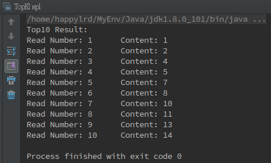

## Appendix

Development environment
  - Ubuntu 16.04
  - IntelliJ IDEA
  - Hadoop
    - MapReduce
    - HDFS

### Recommend

[Map/Reduce之间的shuffle,partition,combiner过程的详解](http://www.cnblogs.com/ljy2013/articles/4435657.html)

### Thanks

Thanks to [Kubi Code](http://kubicode.me/2015/06/27/Hadoop/TeraSort-in-Hadoop/), you saved me a lot of time.

Meanwhile, I found one error in your code that I guessed it's probably because of the wrong hands.

You can add `break;` to let *three or more reduce tasks* work fine. In essence, let partition process work fine.

Modified Code is as follows:

```java
int index = splitPoints.length;
for (int i = 0; i < splitPoints.length; i++) {
    if (key.get() < splitPoints[i]) {
        index = i;
        break;
    }
}
return index;
```

### License

[MIT](http://opensource.org/licenses/MIT)

Copyright &copy; 2017 happylrd
